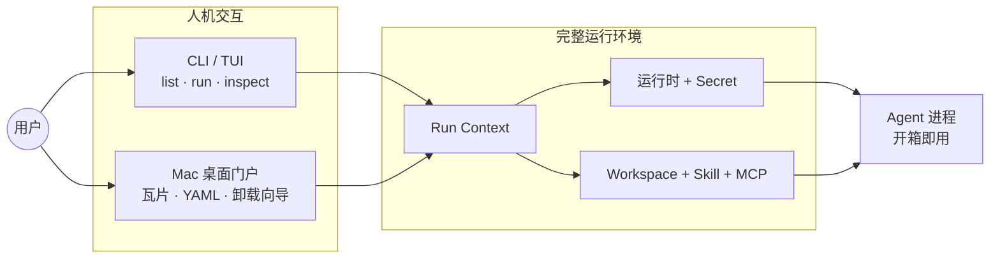

# Agent Hub · 产品定位

#agent-hub

## 一句话

> **agent-hub 不是「装 Agent 的安装器」，而是「能直接开工的 Agent 运行环境」+「方便选用与切换的人机交互启动器」。**

安装、盘点、卸载是**支撑能力**；产品重心是：**把一台机器上散落的 Agent 相关要素，收成可重复、可切换、可一键启动的完整工作环境**。

## 完整运行环境包含什么

一次 `agent-hub run <agent>`（或从桌面门户点选）之前，系统应已准备好该 Agent **立刻能干活**所需的一切，而不是只保证二进制在 PATH 里：

| 层次 | 内容 | 说明 |
|------|------|------|
| **运行时** | Node / Python 等版本 | 委托 mise、nvm、pyenv 等切换，不自己造运行时 |
| **凭据与环境** | API Key、代理、自定义 env | Secret 解析（Keychain / 文件 / env 引用），注入子进程 |
| **工作区** | `workspace` 目录 | 每个 Agent 绑定当前项目上下文 |
| **能力扩展** | Skill、MCP | 软链/挂载到各 Agent 期望的位置 |
| **入口** | `entry` 命令与参数 | 在以上就绪后 spawn 真实 Agent 进程 |
| **状态与足迹** | Run Context + inventory | 同一套数据驱动「能跑」与「能卸」 |

上述全部收敛在 **Run Context**（`~/.agent-hub/agents/<id>.yaml`）——见 [[agent-hub/数据与存储]]。

## 人机交互启动器

产品提供**两层交互**，降低「换 Agent = 重配五件事」的摩擦：

| 形态 | 角色 | 典型动作 |
|------|------|----------|
| **CLI** | 开发者日常入口；脚本与 CI 友好 | `list` 扫一眼 → `run` 开工 → `inspect` 排错 |
| **桌面应用** | 图形化门户；少记命令 | 选 Agent 卡片 → 编辑/校验 YAML → 卸载向导 |
| **`run --shell`** | 进入已配好的 subshell | 交互式调试、手动敲 Agent 子命令 |

CLI 人类可读输出按 TUI 设计（见 [[agent-hub/设计/UI 设计稿索引]]），目标是**扫一眼就决策、点一下就启动**，而不是冷冰冰的包管理器列表。

## 与「仅安装」的边界

| 我们做的 | 我们不做的 |
|----------|------------|
| 编排已有运行时管理器、包管理器、Secret 后端 | 替代 mise / npm / brew 本身 |
| 记账式 install + 安全 uninstall（生命周期管理） | 把「安装」当作唯一主线叙事 |
| 为每个 Agent 维护**可运行的环境配置** | 只下载二进制、不管 env / skill / MCP |
| 提供统一启动入口（CLI + 桌面） | 替代各 Agent 自带 UI 内的全部能力 |

**安装**解决「有没有」；**运行环境 + 启动器**解决「能不能马上用、换起来痛不痛」。

## 能力矩阵（当前 0.0.1）

| 能力 | 状态 | 说明 |
|------|------|------|
| 完整环境编排（run） | ✅ MVP | 运行时、secret、workspace、skill 挂载、spawn |
| CLI 人机交互 | ✅ MVP | list / run / inspect 等 human 输出 |
| 桌面门户 | ✅ MVP | 瓦片、YAML 抽屉、卸载向导 |
| 环境纳管（adopt） | ✅ MVP | 已有安装纳入 Run Context |
| 生命周期（uninstall） | ✅ MVP | dry-run、快照、npm-global 执行 |
| 远程 Adapter 仓库 | 🚧 V1 | 社区 yaml；MVP 本地放置 |

## 相关文档

- [[agent-hub/项目概览]] — 进度与仓库结构
- [[agent-hub/快速开始]] — 从「能跑」入手
- [[agent-hub/设计/产品设计 v2]] — 详细规格（含 Inventory/Cleanup 支柱）
- [[agent-hub/命令参考]]
